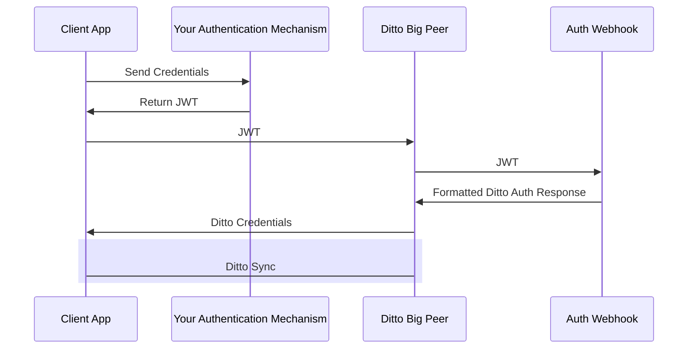

## Online Authentication Mechanisms

The primary mechanisms that Ditto provides for authentication use the Big Peer as a central authentication server. That means that all new devices and users must first connect to the Big Peer to authenticate, prior to being able to join and sync data with the mesh.

### Online Playground

Online Playground mode is Ditto's authentication-light environment intended for development and testing, or use cases that do not require per-user permissioning. It allows developers to get a Ditto-backed application up and running quickly, with minimal setup. In this mode, devices connect through Ditto's Big Peer using a shared app ID and a Playground token, but without unique user authentication. Essentially, it's a sandbox identity provided for convenience.

The Big Peer automatically trusts any client that knows the correct app identifier and its corresponding Playground token. This token (obtainable from the Ditto portal for your app, see [Getting SDK Connection Details](/cloud/portal/getting-sdk-connection-details)) is used to authenticate your SDK to the Big Peer - i.e. it tells the cloud “I belong to application X and I can prove it as I know the password”. Every instance of your app uses the same token. Once the token and app ID are presented, the client can join the cloud-backed mesh and start syncing. There are no user names or passwords; the authentication is a single shared token (hence “Playground”). This makes it extremely easy to connect multiple devices and see data sync in action.

The Online Playground identity is meant for quick experimentation and prototyping. It lets teams explore Ditto platform features and functionality without the hassle of setting up a custom auth server or user management. Typical use cases include proof-of-concept apps, hackathons, or initial development stages where you want to focus on core application logic and test syncing, rather than dealing with authentication infrastructure. It's also useful for demos or tutorials - for instance, spinning up a sample app where everyone uses the same token to join a shared data set.

Playground mode deliberately offers limited security and is generally not recommended for production. As the token is shared and static, it functions more like an API key that is the same for all clients. Anyone in possession of the token can connect and fully access the data. There is no concept of user-level permissions in this mode; all connected clients can read and write all data in the collections for that app. For production or any sensitive data, you'll want to switch to a more secure authentication method.

<Note>
Playground has no individual identities, authorization within the app is essentially all-or-nothing. Every connected device has the same capabilities. If your use case requires certain clients to have read-only access or other restrictions, Playground cannot enforce that, use Online with Authentication instead.
</Note>

### Online with Authentication

Online with Authentication is Ditto's recommended authentication mode for Production. Unlike playground, this mode integrates with real user identities or device credentials. Each client must log in to the Ditto network, and only upon successful authentication is it allowed to sync data. This approach is suitable for apps in the real world where not every device is implicitly trusted - it enables you to verify who is connecting and to control what each client can do. In Online with Authentication, the Ditto Cloud (the Big Peer service) acts as a gatekeeper and coordinates the auth process.

To use the "Online With Authentication" system, your client application is expected to authenticate with your identity system and retrieve some sort of token _prior_ to syncing with Ditto. Often times this token is some sort of identity token, access token, commonly in the format of a JWT (JSON Web Token). You can use an existing identity provider (e.g. Auth0, Clerk) or implement your own custom authentication mechanism.

Once your client application successfully has retrieved this token, it should pass it to the Ditto `authenticator` which will pass it to an authentication webhook. As the developer, you are responsible for writing code and deploying the this webhook to an accessible URL. The authentication webhook will validate and decode the token from the client side and return identity and access control information back to your Ditto instance. 

The full flow is detailed in the diagram below:



<Info>
You can follow the [Online with Authentication](/sdk/latest/auth-and-authorization/cloud-authentication) tutorial to learn how to use the Online with Authentication identity.
</Info>

#### User Permissions
A major benefit of Online with Authentication is that each user or device is distinct, which allows for fine-grained authorization rules. Since the user permissions are centrally managed in this mode, your authentication server can decide what each authenticated identity is allowed to do. These permissions are expressed on each collection in the form of queries, for example:

<Accordion title="Example of a collection with user permissions">
The following write permissions describe that `userID: "123abc"` has been authenticated (`"authenticate": true`) and has the following permissions:

1. `write` to documents in the `"books"` collection matching the query `"_id.locationId == 'abcedef123456'"`.
2. `write` to any document in the `"newspapers"` collection. This is done with the single-word query `"true"`
3. `read` to documents in the `"books"` collection matching the query `"_id.locationId == 'abcedef123456'"`

```json JSON {9-14, 20-22}
{
  "authenticate": true,
  "expirationSeconds": 28800,
  "userID": "123abc",
  "permissions": {
    "write": {
      "everything": false,
      "queriesByCollection": {
        "books": [
          "_id.locationId == 'abcedef123456'"
        ],
        "newspapers": [
          "true"
        ]
      }
    },
    "read": {
      "everything": false,
      "queriesByCollection": {
        "books": [
          "_id.locationId == 'abcedef123456'"
        ],
      }
    }
  }
}
```
</Accordion>

<Info>
To prevent users being able to "hijack" documents they should not have access to when using peer-to-peer replication, Ditto enforces that permissions can only be specified on the immutable `_id` field of a document.
You should ensure that you model your data so that all of the fields that you want to control access to are part of the `_id` field.
</Info>

This means you could have viewer roles that only sync down data but cannot make edits, while admin roles have full read-write capabilities. All such rules are enforced by both the Big Peer and all devices participating in sync in the mesh. If a client tries to synchronize a document it isn't authorized for, the document will not be synchronized. Moreover, because authentication is individual, you can set a single user's permissions without affecting others. This granular control is essential for multi-user applications and aligns with typical enterprise security requirements.

You can read more about how to appropriately authorize users in [Authorizing Users](/sdk/latest/auth-and-authorization/data-authorization).

### Detailed Online Certificate Flow

Both online mechanisms follow the same basic flow, though they differ in how the supplied credentials are validated.

<Steps>
    <Step title="Complete a Peer Key Challenge">
    The peer's public key will be included in the certificates returned by the identity service. The identity service needs proof that the authenticating Small Peer actually holds the corresponding private key.

    1. Small Peer downloads a challenge token from `/_ditto/auth/cert` - this is a time-limited JWT which the client treats as opaque data.
    2. Small Peer uses their Peer Key to sign it.
    </Step>
    <Step title="Log in with Credentials">
    When a client attempts to authenticate, it will make an HTTPS request to the identity service containing the following payload:

      - Signed challenge
      - App ID
      - Provider name
      - Credentials to be forwarded to the app's webhook handler

      Once the identity service has a response from the auth webhook or the playground token validation process, it will build and sign a JWT. In addition to the information we would expect to find in a JWT (issuer, issued at, expiry, etc), we also include an encoded representation of the Ditto Identity.
      The Ditto Identity is built from the information provided by the app's authentication webhook response.
    </Step>
    <Step title="Upgrade to an X.509 Certificate">
      Once a peer has a JWT, it will want to use this to get a device certificate.  The peer will now make an HTTPS certificate request to the identity service.

      The “request certificate” endpoint requires a valid JWT.  The contents of the new certificate is closely tied to the JWT.  The certificate expiration time is the same as the JWT, and the ditto identity embedded in the certificate is pulled from the JWT.  The identity service generates a private key for the device.  It uses this private key to generate a CSR on behalf of the client and then the identity service’s CA keys to sign it.

      Once this information is prepared, the identity service is ready to respond to the request.

      The response will include the client's generated certificate and private key, a list of CA certificates the client should trust, and a DateTime for expiration. The client will persist the JWT, device private key, device certificate, and CA certificates on disk and only update them when they get near expiration.

      When two peers authenticate with each other, they can use either the JWT or the device certificate via MTLS. The decision depends on the client's capabilities and connection type.
    </Step>
</Steps>

## Offline Shared Key

Shared Key authentication in Ditto is a simple, pre-shared secret model. It offers an intermediate level of security for scenarios where all devices and users are inherently trusted. In this mode, every peer (device) in the Ditto network is configured with the same secret key. As long as a device knows the shared key, it is considered authenticated and can join the network.

All participants share a single secret cryptographic key that identifies the group. If a device presents the correct key, Ditto trusts it as an authenticated peer. In effect, any device is trusted provided they know the secret key. There is no central server verifying identities - trust is entirely based on possession of the shared secret. This makes setup straightforward (no user accounts or token exchanges are needed). Communication is encrypted using TLS 1.3 and peer identities are verified using certificates. This is the same state-of-the-art technology used in web browsers. It applies to every communication mode from Bluetooth to WiFi.

Each device issues a self-signed TLS certificate using the supplied private key. Peers then only trust peers whose certificates are signed by the same key. In other words, Shared Key uses regular TLS security, except everybody is the CA.

Shared Key mode is designed for closed, controlled environments. For example, an enterprise might use it on a fleet of devices that are centrally managed and not connected to the Internet. It's suitable for offline or air-gapped deployments - such as on airplanes or on ships. In such cases, the shared key provides a quick way for devices to recognize each other and sync data without any cloud service.

This mode assumes a high level of pre-existing trust. It is only suitable for private apps where users and devices are both trusted to perform any actions. All devices effectively have the same access rights, because they authenticate with the same credentials. There is no user-level differentiation – if you have the key, you have full read/write access to the data. Therefore, protecting the shared key is critical. If it were leaked or stolen, an unauthorized device could join and gain equal access. There's also no way to revoke a single device's access (short of changing the key for all devices). You should use Shared Key only when key distribution can be tightly controlled via a mechanism like MDM and when the convenience of offline operation outweighs the lack of granular security controls.

In general, we recommend using online authentication for any internet-connected or user-centric application.

<Note>
If you have a use-case where you cannot use online authentication, but wish to use per-device permissions, then you can setup a [standalone C# auth server](/best-practices/how-to/c-sharp/authentication-server).

Please get in touch with us if you'd like assistance in setting up a standalone auth server.
</Note>

<Accordion title="Generating a shared key" icon="key">
The recommended way to generate a shared key is to download Ditto's open-source, cross-platform utility [`ditto-authtool`](https://github.com/getditto/authtool), which provides an easy command to generate new shared keys from a terminal or command prompt:

```Text Text
./ditto-authtool generate-shared-key

// or

.\ditto-authtool.exe generate-shared-key
```

Alternatively, if you have a Linux machine running an up-to-date version of OpenSSL then you can use the following command. At time of writing this will not work on Macs.

```Text Text
openssl genpkey -algorithm EC -pkeyopt ec_paramgen_curve:P-256 -outform pem | openssl pkcs8 -topk8 -nocrypt -outform der | base64 -w 0
```

The SharedKey identity requires an offline-only license token, which can be requested by contacting [support@ditto.live](mailto:support@ditto.live).
</Accordion>