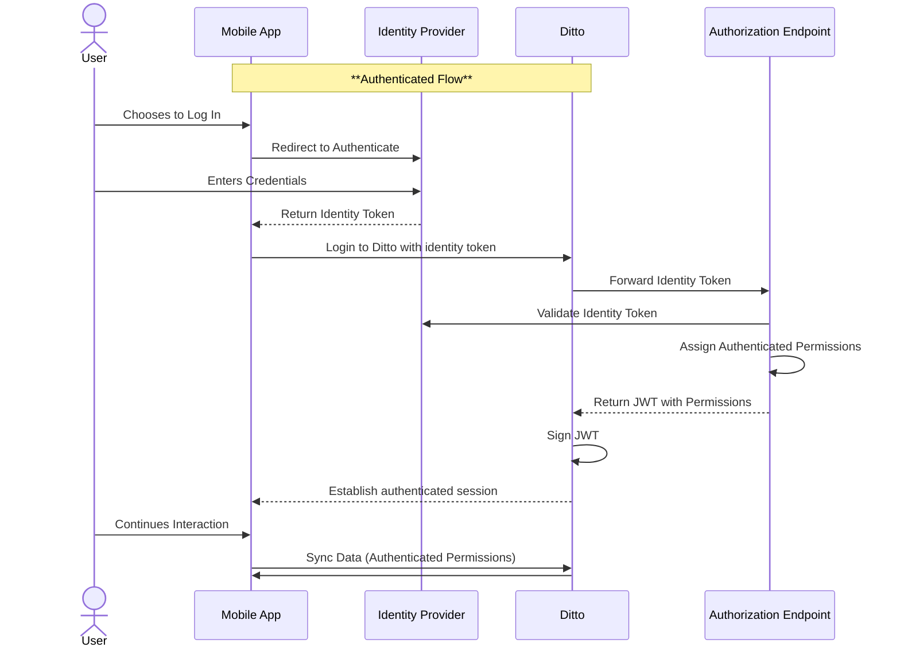

## Ditto Auth Flow

### Components

- **Ditto**: The [Ditto SDKs](/sdk/latest/install-guides/install-guides) and [Ditto Cloud](/cloud/overview) services (backend). Developers interact with Ditto via the SDK on the device and via the [Ditto Portal](https://portal.ditto.live/) in the cloud.
- **Customer Components**: The application (app), the authorization endpoint (a backend service), and the Identity Provider (IdP).
- **Identity Provider (IdP)**: This is the service that manages user identities. User logs in, and the IdP issues them a token, that is used elsewhere in the system to represent that user. IdP can be either a fully managed third-party service (for example Auth0), or a service maintained by the customer. The login method depends on user’s preferences and the IdP's features and requirements—from straightforward username/password to social login with Google or Facebook, magic email links, multi-factor authentication, and more.
- **Authorization endpoint** is a service deployed and accessible from the web; its URL is stored in the Ditto portal. It’s responsible for assigning user access permissions to documents and collections in Ditto, and validating user tokens.

### Auth Flow

- To establish identity in the app, the user performs a login action with their identity provider.
- The Ditto SDK requires the user token to call the `ditto.login` method.
- When `ditto.login` is called, Ditto forwards the user token to the customer's authorization endpoint.
- Commonly, after login, the IdP generates an identity token containing the user ID and signs it with the IdP's private key. The [JSON Web Token (JWT)](https://jwt.io/) format is commonly used.
- The customer's authorization endpoint needs to accept HTTP requests from Ditto with the JWT as the payload, and:
  - **Verify the JWT's authenticity**: This is typically done by verifying the JWT's signature using the IdP's public key, either via an SDK method or an API call to the IdP's token validation endpoint.
  - **Respond to Ditto with a new JWT containing permissions**: This JWT contains the read and write permissions for Ditto collections specific to that user. This often involves a database lookup for the user's role and set of permissions, and transforming them into Ditto's expected format.
- Ditto backend will sign the received JWT with its own certificate and pass it back to the customer application. This completes the login flow and allows the logged-in user to interact with Ditto.

## Differences and Similarities Between MongoDB Atlas App Services and Ditto Implementations

### Authentication

**Atlas
**The now-deprecated MongoDB Atlas App Services bundled a way to access some identity providers and a permissions layer. Bundled IdPs included common providers like email and OpenID (such as Google).

**Ditto**
Ditto doesn't bundle an identity provider; the customer always brings their own.

**Both**
Many customers who operate their own custom IdP would need to integrate it in both Atlas and Ditto.

### Authorization

**Atlas**
Permissions and roles were defined and stored directly in Atlas, in MongoDB's JSON-like format.

**Ditto
**Permissions are assigned via a webhook invocation from Ditto to the customer's authorization service that returns a JWT with permissions to Ditto.

User roles and permissions can be stored anywhere—for example, in the customer's own custom IdP solution.

### Learn More

<CardGroup> 
<Card title="Ditto Cloud Authentication" icon="cloud" href="/sdk/latest/auth-and-authorization/cloud-authentication" iconType="solid" horizontal/> 
<Card title="Ditto Shared Key Authentication" icon="key" href="/sdk/latest/auth-and-authorization/shared-key" iconType="solid" horizontal/> 
<Card title="Ditto Data Authorization" icon="lock" href="/sdk/latest/auth-and-authorization/data-authorization" iconType="solid" horizontal/> 
<Card title="Ditto Certificate-Based Security" icon="certificate" href="/sdk/latest/auth-and-authorization/certificate-based-security" iconType="solid" horizontal/> 
</CardGroup>
