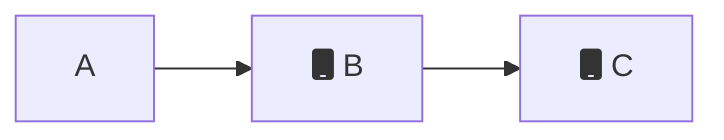
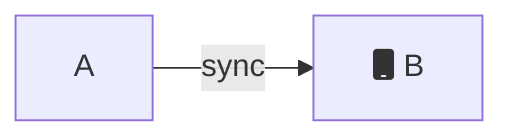
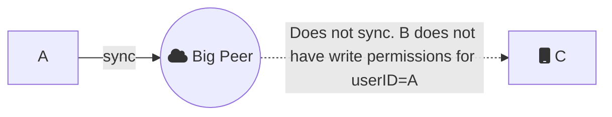

For instance, junior staff members are limited to read-only access, while senior staff members have permission to both read and write documents.

You can issue each certificate manually or with the `OnlinewithAuthentication` digital identity.

## Accepting a user

To grant full `read` and `write` permissions to all collections and all documents:

```json JSON
{
  "authenticate": true,
  "expirationSeconds": 28800,
  "userID": "123abc",
  "permissions": {
    "read": {
      "everything": true,
      "queriesByCollection": {}
    },
    "write": {
      "everything": true,
      "queriesByCollection": {}
    }
  }
}
```

- `authenticate` to `true` to tell the webhook that the user has successfully validated
- `expirationSeconds` is `number` property on how long the authentication session is valid for before a refresh is required.
- `userID` is a `string` which identifies the the `userID`. This should be unique across users within your app.
- `permissions` which describes all the types of access control for collections and documents that this user can `read` or `write`.

## Rejecting a user

To reject a user from reading or writing at all, specify the JSON payload:

```json JSON
{
  "authenticate": false
}
```

## Using the \_id field

Currently, you can only specify a permission query on the `_id` field of a document. Permissions on mutable properties are currently not supported.

To grant selective permissions on specific documents, add to the
`queriesByCollection` property inside either the `read` or `write` property.
Each key inside `queriesByCollection` is a reference to the collection. Each
value is an `array` of Ditto queries describing which documents the user can read or write.


<Info>
  Permissions must be written using the legacy query syntax and not DQL. For more see [Query Syntax (Legacy)](https://docs.ditto.live/auth-and-authorization/data-authorization#Pw82J_oFrBgM-27WMrKJm).
</Info>

## Setting Identity Service User Metadata

During the authentication process you can specify user specific metadata that will be available on that users given peer object. This information will be signed by the server and available to other peers in the mesh via the `identityServiceMetadata` field for the given peer.


<Warning>
  Information in the user metadata is available to all connected peers within the mesh. Ensure your are only adding any information that should be shared with other peers.
</Warning>

```json JSON
{
  //...
  "identityServiceMetadata": {}
}
```

***Example***

```json JSON
{
  //...
  "identityServiceMetadata": {
    "userID": "123456",
    "userEmail": "sandra@example.com"
  }
}
```

## Example

The following write permissions describe that `userID: "123abc"` can:

1. `write` to documents in the `"books"` collection where the `_id.locationId == 'abcedef123456'`.
2. `write` to any document in the `"newspapers"` collection. We use a single value of `true`
3. `read` to documents in the `"books"` collection where the `_id.locationId == 'abcedef123456'`

```json JSON
{
  "authenticate": true,
  "expirationSeconds": 28800,
  "userID": "123abc",
  "permissions": {
    "write": {
      "everything": false, // ensure that this is false
      "queriesByCollection": {
        // highlight-start
        // 1.
        "books": [
          _id.locationId == 'abcedef123456'
        ],
        // highlight-end

        // highlight-start
        // 2.
        "newspapers": [
          "true"
        ]
        // highlight-end
      }
    },
    "read": {
      "everything": false, // ensure that this is false
      "queriesByCollection": {
        // highlight-start
        // 3.
        "books": [
          _id.locationId == 'abcedef123456'
        ],
        // highlight-end
      }
    }
  }
}
```

## Threat modeling in P2P networks

Threat modeling is a process used by software engineers to identify, analyze, and prioritize threats that could potentially impact an application. It helps engineers identify potential weak points in an application and take steps to mitigate those risks. Threat modeling involves identifying the assets that an application needs to protect, assessing the potential threats to those assets, and determining the best ways to protect them.

By identifying potential risks, engineers can ensure that the application is secure from malicious actors and that users' data is protected. Threat modeling can also help ensure that the application meets the company's security standards and regulations.

Threat modeling in peer-to-peer (P2P) networks is different than that in client-server networks due to the distributed nature of the P2P network. In a client-server network, there is a single server that all clients connect to, and thus all of the data and resources are centralized. This makes it easier to identify potential threats and vulnerabilities, but creates a entry that can be targeted by an attacker, making it easier to exploit the entire network at once.

Peer-to-peer (P2P) networks are networks that do not have a central server, but rather all nodes are equal, allowing clients to share resources with each other directly. As such, P2P networks have more restrictive permissions on synchronization than client-server authentication systems, as nodes are required to agree to any changes made by other peers. This is done to ensure that no node has an advantage over another and that all nodes remain secure.

Therefore, even though peers in Ditto may have overlapping subscriptions, Ditto peers are only able to synchronize data directly from a peer that has the authority to write that
document. In other words, small peers are only able to trust writes from other peers that have the authority to make those writes. They cannot trust each other as a source of
data that they aren't authorized to write to, since they can't tell the difference between an edit they made on their own and one which came from a further hop.

### Read-only security model

Because Ditto peers are only able to synchronize data directly from a peer that has the authority to write that document, a read-only security model comes with some caveats. This section covers how to best implement this security model and the trade-offs that exist in peer-to-peer networks.

Ditto provides a mechanism to specify which small peers can read documents in a collection *without permission to write*. This can be useful in situations where you have restrictive user roles, such as customer and employee.

To implement read-only documents, you should create restrictive write permissions that include the `userId` inside of the document `_id`.  Ditto ensures that only those authorized to create documents with a particular document `_id` are able to synchronize those documents in a trustworthy manner throughout the system.

```json JSON
{
  "authenticate": true,
  "expirationSeconds": 28800,
  "userID": "A",
  "permissions": {
    "read": {
      "everything": true,
      "queriesByCollection": {}
    },
    "write": {
      "everything": false,
      "queriesByCollection": {
        "messages": ["_id.userID == 'A'"]
      }
    }
  }
}
```

### Read-only example

In this example, peers can read chat messages from other people, but cannot
write to them. They can only write their own chat messages.

Imagine three peers, Peer A, B, and C. Peers A and B are connected, but Peer C only connected to peer B.



Every peer has similar permissions, where they can read everything but can only write to a collection with an `_id` that represents their `userID`. So, for example, Peer A has the following permissions:

```json JSON
{
  "authenticate": true,
  "expirationSeconds": 28800,
  "userID": "A",
  "permissions": {
    "read": {
      "everything": true,
      "queriesByCollection": {}
    },
    "write": {
      "everything": false,
      "queriesByCollection": {
        "messages": ["_id.userID == 'A'"]
      }
    }
  }
}
```

Peer A writes a message and syncs that message to B.

```json JSON
{
  "_id": {
    "messageId": "00372532806762369024",
    "userID": "A"
  },
  "text": "Hello world!"
}
```



However, Peer B cannot forward that message from A to C. This is because peer B does not have write permissions to create documents with `userID=A`.



Today Ditto enforces that data which has to propagate peer-to-peer must have mutual
write permissions. If integrity is at risk, you have to sign the payloads yourself at the application level.

This is a credible attack vector, especially if Peer A represents an authority in the system, such as an administrative user. This design prevents a hacker from impersonating Peer A, because other peers will only synchronize documents from Peer A when they have a direct connection to Peer A, and can verify their certificate is valid.

### Threat

A hacker attempts to write messages *pretending to be peer A* even though they are only allowed to read.

1. Steal mobile phone that is authorized as Peer B
2. Create documents pretending to be Peer A.

This is a credible attack vector, especially if Peer A represents an authority in the system, such as an administrative user. This design prevents a hacker from impersonating Peer A, because other peers will only synchronize documents from Peer A when they have a direct connection to Peer A, and can verify their certificate is valid.

### App-level Security

The access rules contained in the identity are rigid, signed by the central certificate authority, and enforced by all participating devices. This offers the highest level of security. If a device is not allowed to access particular data, it will never be synced to their device.

For apps with weaker security requirements, a developer may choose to relax the
access rules inside the Ditto certificate, and instead restrict access in their application code.

One advantage is that the developer has more flexibility to change the access rules dynamically since they are not encoded in signed certificates. Another advantage is that all devices in the mesh can participate in syncing the data, which may help it propagate faster. If certain data is only accessible to a few privileged devices which are not often in range of each other, it will take longer for them to sync.

The disadvantage is that an unprivileged user does have a device containing privileged data. A technically savvy user or phone thief may be able to gain access to not only their regular data, but also the more privileged data that they were never intended to be able to view.

Therefore relaxed access rules - app-level security - are only suitable for environments where there is a degree of trust that the devices won't end up unlocked in the wrong hands.

## Authenication Webhook Response Schema

Below is a schema definiton that describes the JSON response Ditto Cloud expects from the authentication webhook.


```json JSON SCHEMA
{
  "$schema": "http://json-schema.org/draft-07/schema#",
  "title": "Webhook Response",
  "description": "This describes the JSON response Ditto Cloud expects from the authentication webhook receiver.",
  "type": "object",
  "required": [
    "authenticated"
  ],
  "properties": {
    "authenticated": {
      "description": "Should this request be authenticated?",
      "type": "boolean"
    },
    "clientInfo": {
      "description": "This is an optional arbitrary JSON blob that can be provided.  It will be passed through the system and provided to the client."
    },
    "expirationSeconds": {
      "description": "The amount of time in seconds in which the session should be valid.  This field is required if authenticated is true.",
      "type": [
        "integer",
        "null"
      ],
      "format": "uint32",
      "minimum": 0.0
    },
    "identityServiceMetadata": {
      "description": "This is an optional dictionary that can be provided which will be signed by the identity service and gossiped through the presence data between peers. Because it's stored and shared proactively between every peer on the mesh, it's important to keep this data as small as possible.",
      "type": [
        "object",
        "null"
      ],
      "additionalProperties": true
    },
    "identityServiceSignedInfo": {
      "description": "DEPRECATED: Migrate to identityServiceMetadata.",
      "default": null,
      "readOnly": true,
      "type": [
        "object",
        "null"
      ],
      "additionalProperties": true
    },
    "permissions": {
      "description": "The permission set for the user for this session.  This field is required if authenticated is true.",
      "anyOf": [
        {
          "$ref": "#/definitions/Permission"
        },
        {
          "type": "null"
        }
      ]
    },
    "userID": {
      "description": "The users identity inside Ditto.  This field is required if authenticated is true.",
      "default": null,
      "type": [
        "string",
        "null"
      ]
    }
  },
  "definitions": {
    "Permission": {
      "type": "object",
      "required": [
        "read",
        "write"
      ],
      "properties": {
        "read": {
          "description": "The set of read permission granted",
          "allOf": [
            {
              "$ref": "#/definitions/PermissionRules"
            }
          ]
        },
        "remoteQuery": {
          "description": "Can this initiate remote queries?  In addition to this, remote queries also require full read permission.  Defaults to false",
          "type": [
            "boolean",
            "null"
          ]
        },
        "write": {
          "description": "The set of write permission granted",
          "allOf": [
            {
              "$ref": "#/definitions/PermissionRules"
            }
          ]
        }
      }
    },
    "PermissionRules": {
      "type": "object",
      "required": [
        "everything",
        "queriesByCollection"
      ],
      "properties": {
        "everything": {
          "description": "Does the user have unlimited permissions of this type?",
          "type": "boolean"
        },
        "queriesByCollection": {
          "description": "If 'everything' is set false then this contains a list of rules that define what the entity may access.  The key is the collection and the value is a set of queries.",
          "type": "object",
          "additionalProperties": {
            "type": "array",
            "items": {
              "type": "string"
            }
          }
        }
      }
    }
  }
}
```

